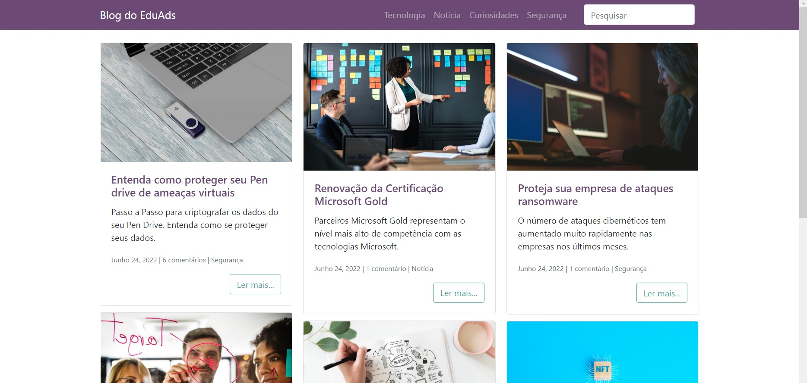

# App Blog
Este repositório trata-se de um blog sobre tecnologia feito utilizando Python e Django.

# APRESENTACAO
Construir uma aplicação web para que o usuário seja capaz de:
- Visualizar o layout da pagina independente do tamanho da tela do dispositivo;
- Visualizar posts e seu conteúdo;
- Visualizar e adicionar comentários em cada post;
- Pesquisar sobre algum post específico no campo busca;

Construir uma aplicação web para que o administrador seja capaz de:
- Adicionar ou editar posts de forma prática direto na seção para administradores;

# METODOLOGIA
Aplicação de conceitos em:
- Python
- Django
- HTML;
- CSS;
- Bootstrap;
- Layouts Responsivos.
- Banco de Dados
- Hospedagemde sites

# SCREENSHOTS DO PROJETO

# LINK DO PROJETO
Para visualizar o projeto no seu navegador utilize o link abaixo:

https://blog.eduardomb.com.br
